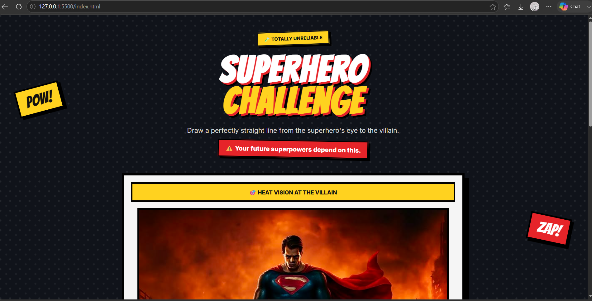
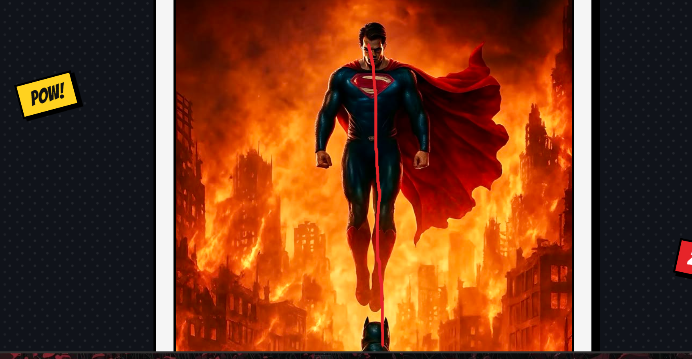
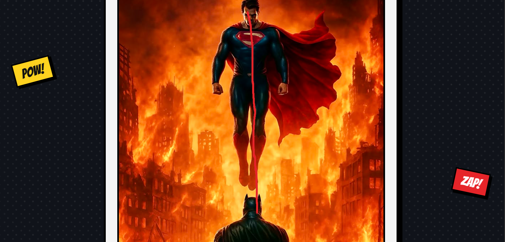
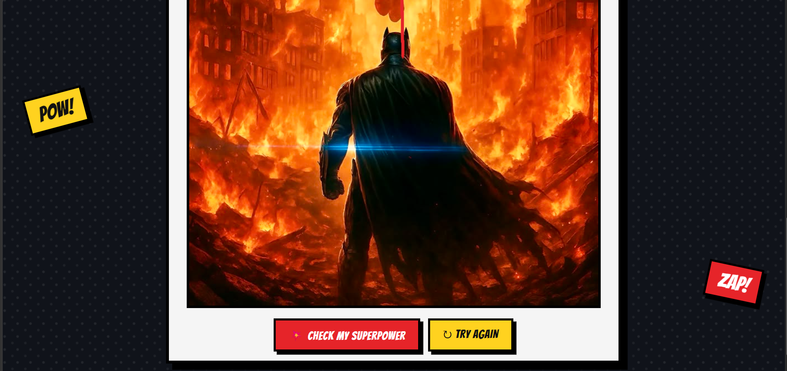
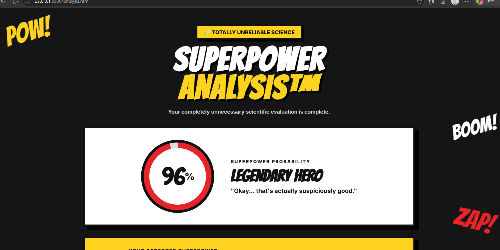
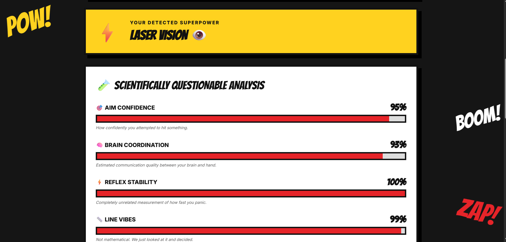
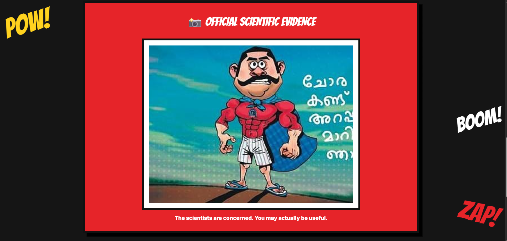
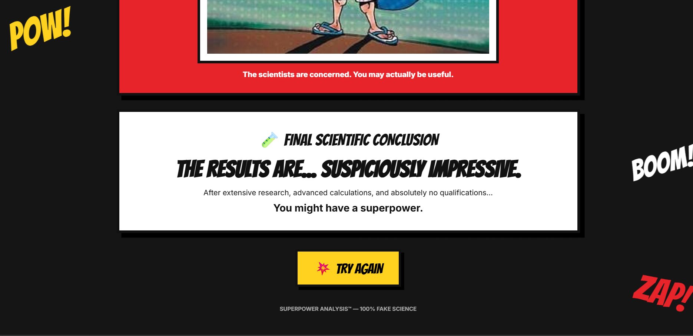

# [SUPERPOWER] 🎯

## Basic Details
### Team Name: [Two brain zero use]

### Team Members
- Team Lead: [Dhanush Ajayan] - [NSS college of engineering]
- Member 2: [Essabella C Jose] - [NSS college of engineering]

### Project Description
[A completely unnecessary web application that tests how accurately you can draw a straight line from Superman's eye to a villain. Your drawing accuracy is then converted into a completely fake *"probability of having superpowers."*

The project provides a ridiculous scientific analysis, sarcastic comments, a fake superpower, and a reaction meme based on your performance.]

### The Problem (that doesn't exist)
[Humanity has never had a reliable way to determine whether someone has superpowers by drawing a straight line.
This project solves this extremely serious problem.
Apparently, if you cannot draw a straight line, you are probably just a normal human.]

### The Solution (that nobody asked for)
[The user draws a line from the superhero's eye toward the villain.
JavaScript analyzes how straight the drawn line is and converts the result into a completely meaningless superpower percentage.
The result page then performs an advanced scientific analysis including:
- 🎯 Aim Confidence
- 🧠 Brain Coordination
- ⚡ Reflex Stability
- 📏 Line Vibes
- 💀 Villain Intimidation
- 🦸 Superpower Probability
The system then assigns a fake superhero rank, a random superpower, a sarcastic comment, and one of three reaction memes.
*Scientific accuracy: 0%. Entertainment value: hopefully 100%.*]

## Technical Details
### Technologies/Components Used
For Software:
- [- *Languages used*
  - HTML
  - CSS
  - JavaScript]
- [- *Frameworks used*
  - None]
- - *Libraries used*
  - None
  - HTML5 Canvas API]
- [- *Tools used*
  - Visual Studio Code
  - Git
  - GitHub
  - Web Browser]

### Project Documentation
For Software:

# Screenshots (Add at least 3)

### Project Demo
# Video
<video controls src="assets/Demovideo.mp4" title="Title"></video>

[The video demonstrates the Superhero Challenge website, where the user draws a straight line from the superhero’s eye toward the villain. The website analyzes the accuracy of the drawn line and generates a humorous superpower prediction, hero rank, sarcastic comment, and meme based on the user's score.]

---
Made with ❤️ at TinkerHub Useless Projects 

